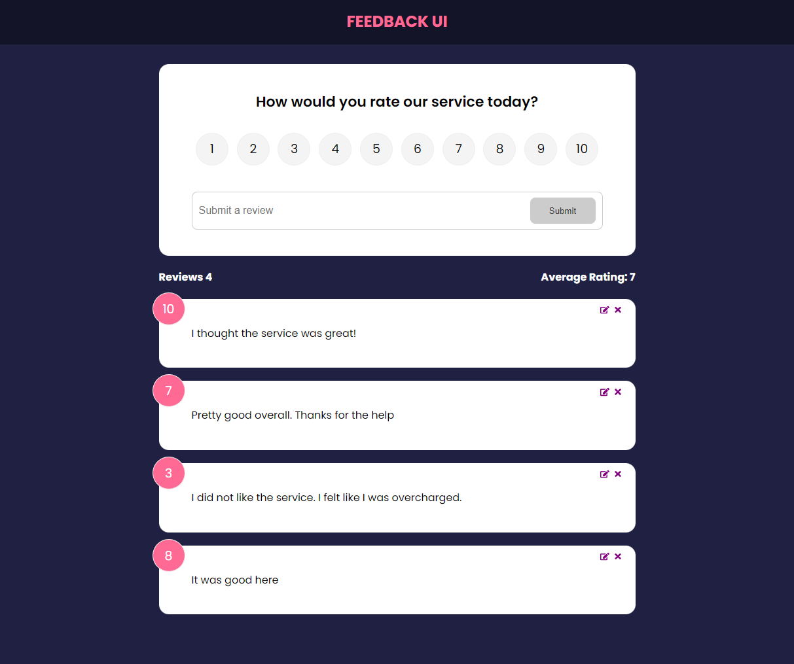
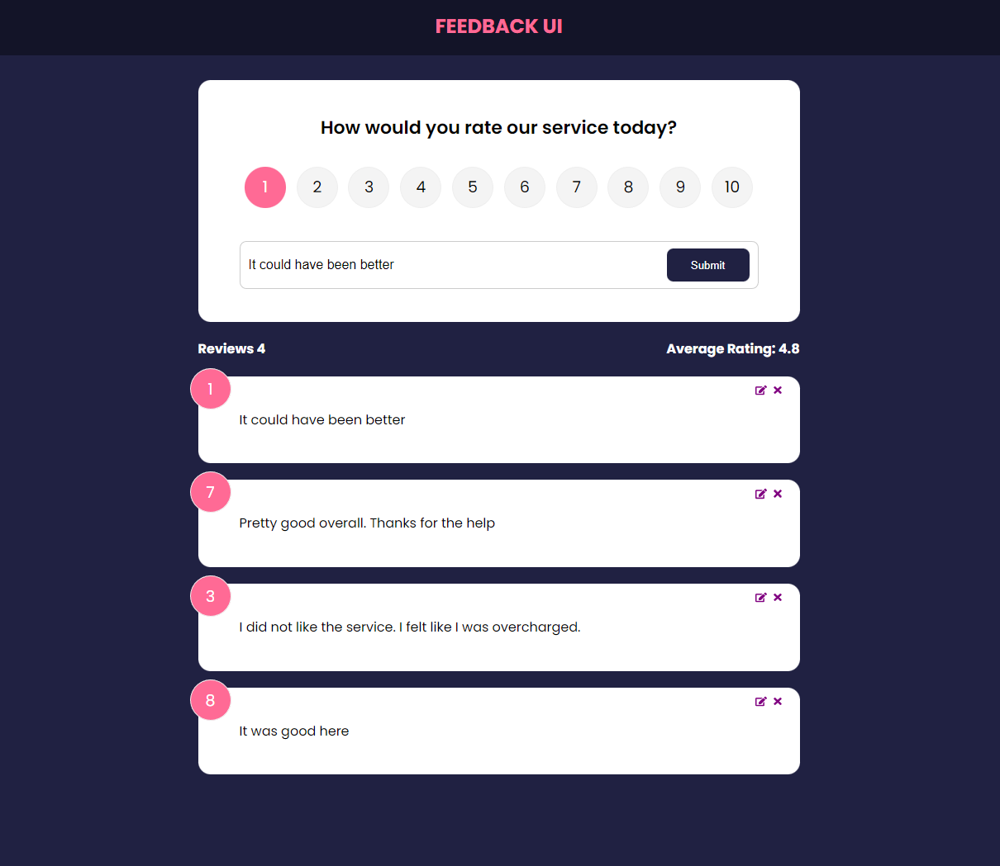

## Feedback-UI is a full-stack app
The feedback-ui app is built using React and JSON Server. A user is allowed to add, edit, and delete their feedback updating the database in the process.




## Getting Started

### Clone this repository

```bash
git clone git@github.com:joeepark/Feedback-UI.git
```

### Install dependencies

```bash
npm install

```
### Run json server

```bash
npm start
```

### Run in development

```bash
npm run dev
```

Please make sure the API_URL matches your json server port in src/context/FeedbackContext.jsx