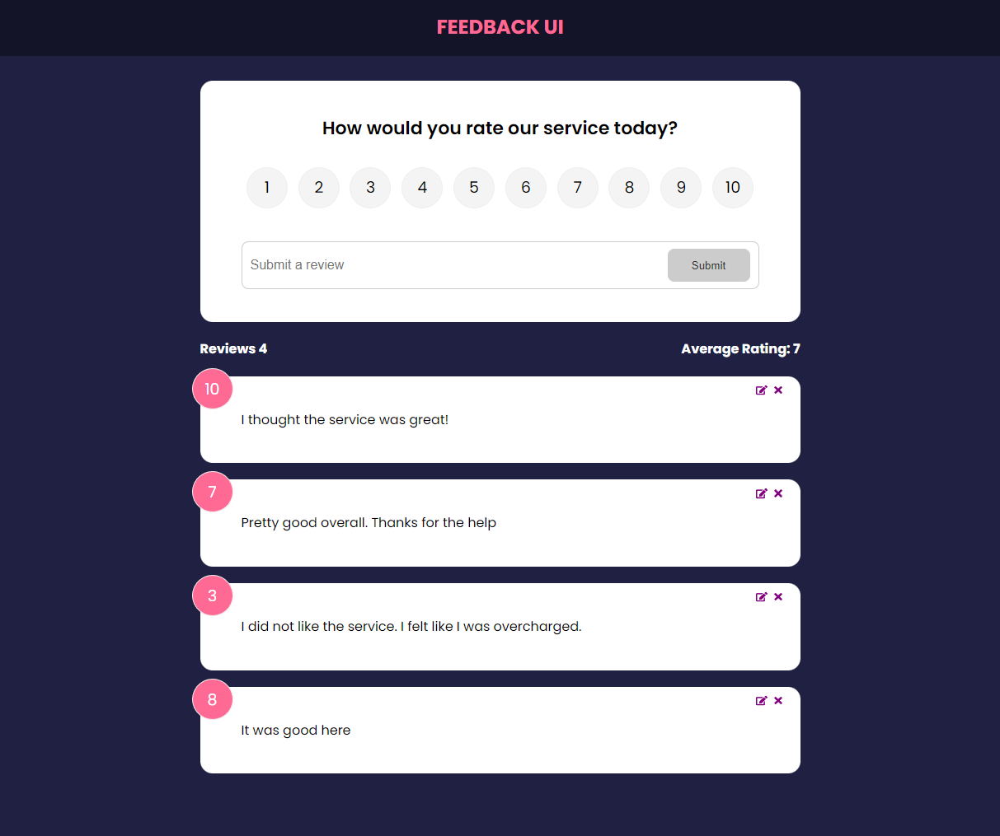
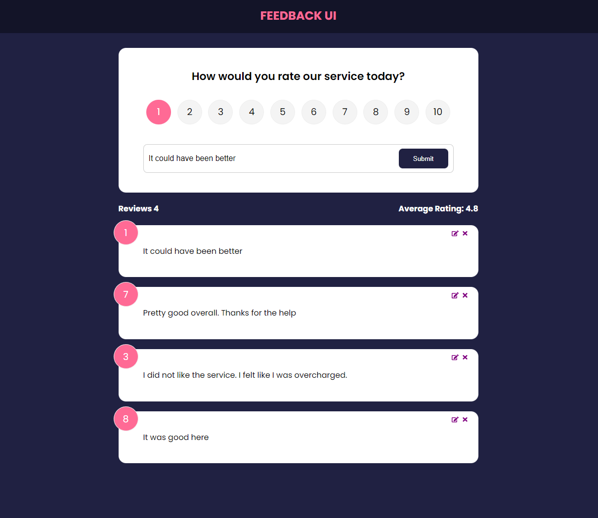
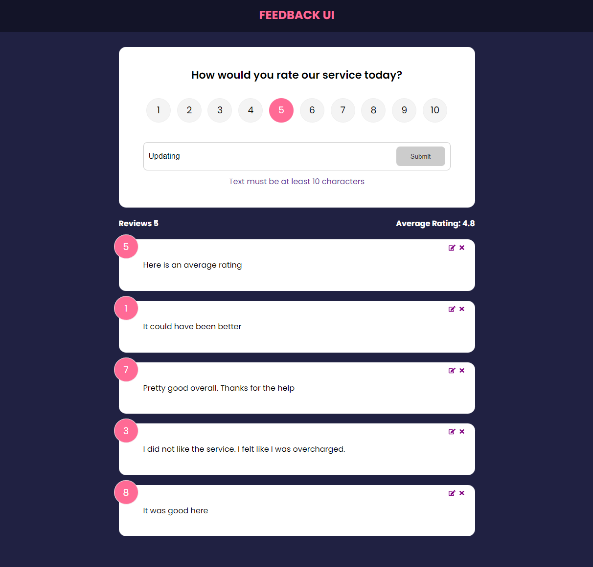

## Feedback-UI is a full-stack app
The feedback-ui app is built using React and JSON Server. A user is allowed to add, edit, and delete their feedback updating the database in the process.




## Getting Started

### Clone this repository

```bash
git clone https://github.com/davidkim7773/covid-stats.git
```

### Install dependencies

```bash
npm install
```

### Run in development

```bash
npm run dev
```
